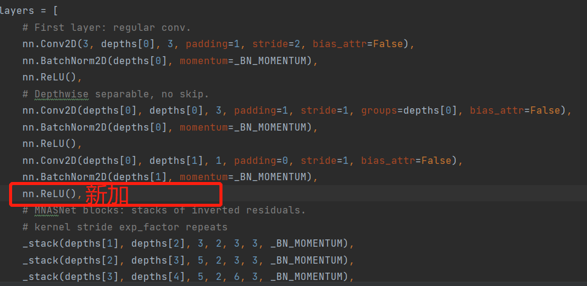

# 基于PaddleClas复现 MnasNet: Platform-Aware Neural Architecture Search for Mobile
## 1. 简介
论文提出了移动端的神经网络架构搜索方法，该方法主要有两个思路，首先使用多目标优化方法将模型在实际设备上的耗时融入搜索中，然后使用分解的层次搜索空间，来让网络保持层多样性的同时，搜索空间依然很简洁，能够使得搜索的模型在准确率和耗时中有更好的trade off
### 1.1 模型结构说明
- 根据MnasNet[参考代码](https://github.com/pytorch/vision/blob/master/torchvision/models/mnasnet.py)复现，val的acc在0.6左右一直上不去。
- 参照[mxnet版本](https://github.com/chinakook/Mnasnet.MXNet)，在参考代码的结构上添加一层relu激活函数，此后的模型表现正常


**[模型网络代码](./ppcls/arch/backbone/model_zoo/mnasnet.py)**

## 2. 数据集和复现精度
数据集使用ImageNet 2012的训练数据集，有1000类，训练集图片有1281167张，验证集图片有50000张，大小为144GB  
aistudio上的地址为：https://aistudio.baidu.com/aistudio/datasetdetail/79807  
### 2.1 补充说明
存在奇怪的问题，训练时的评估精度与单独评估时的精度不一致。（训练两次都存在该情况） 
stage2.log中best_model的top1为0.7347，但是用eval.py评估时却达不到这个精度。报告的复现精度以eval.py的为最终结果

|         Model        | Top1|
|:--------------------:|:-----:|
| MnasNet-A ([torchvision实现](https://github.com/pytorch/vision/blob/master/torchvision/models/mnasnet.py))| 73.5|
| MnasNet-A (复现)|  73.43|
 

### 2.1 log信息说明
训练分为两个阶段
1. 用[config1](./configs/local/mnasnet_0_2.yaml)训练301epoch，设备Titan XP * 4
2. 加载阶段1的epoch_301权重，用[config2](./configs/local/mnasnet_0_3.yaml)训练200epoch，设备aistudio v100 * 4

## 3. 准备环境
* 框架：PaddlePaddle == 2.2.0

## 4. 快速开始
### 4.1克隆本项目
```
https://github.com/renmada/MnasNet-paddle.git
```
### 4.2 下载数据集，放到指定位置
### 4.3 一阶段训练
```
# 修改./configs/local/mnasnet_0_2.yaml中的output_dir image_root cls_label_path的路径

python -m paddle.distributed.launch tools/train.py -c ./configs/local/mnasnet_0_2.yaml
```
### 4.4 二阶段训练
```
# 修改./configs/local/mnasnet_0_3.yaml中的output_dir image_root cls_label_path pretrained_model的路径

python -m paddle.distributed.launch tools/train.py -c ./configs/local/mnasnet_0_3.yaml
```
[aistudio](https://aistudio.baidu.com/aistudio/clusterprojectdetail/3394082)一键复现

### 4.5 相关文件
|         阶段        | log | 权重 |
|:--------------------:|:-----:|:------------------:|
| stage1|  [stage1.log](./log/stage1.log)   | [epoch_301](./checkpoint)|  
| stage2|  [stage2.log](./log/stage2.log)|  [epoch199](./checkpoint) | 
|eval|[eval.log](./log/eval.log)|[epoch199](./checkpoint)|


### 4.6 评估
```
# 修改eval.yaml中的output_dir image_root cls_label_path pretrained_model的路径

python tools/eval.py -c configs/local/mnasnet_0_3.yaml -o Global.pretrained_model=epoch_199
```

### 4.7 预测
```
# infer.yaml中的infer_imgs image_root cls_label_path pretrained_model的路径

python tools/infer.py -c infer.yaml
```


```
[{'class_ids': [281, 287, 285, 282, 286], 'scores': [0.37849, 0.21314, 0.14284, 0.03594, 0.01698], 'file_name': 'demo/cat.jpg', 'label_names': ['tabby, tabby cat', 'lynx, catamount', 'Egyptian cat', 'tiger cat', 'cougar, puma, catamount, mountain lion, painter, panther, Felis concolor']}]```
```
## 5 tipc轻量测试
```bash
# 准备数据
bash test_tipc/prepare.sh ./test_tipc/config/mnasnet/mnasnet1_0_train_infer_python.txt 'lite_train_lite_infer'
# 运行测试
bash test_tipc/test_train_inference_python.sh ./test_tipc/config/mnasnet/mnasnet1_0_train_infer_python.txt 'lite_train_lite_infer'
```


